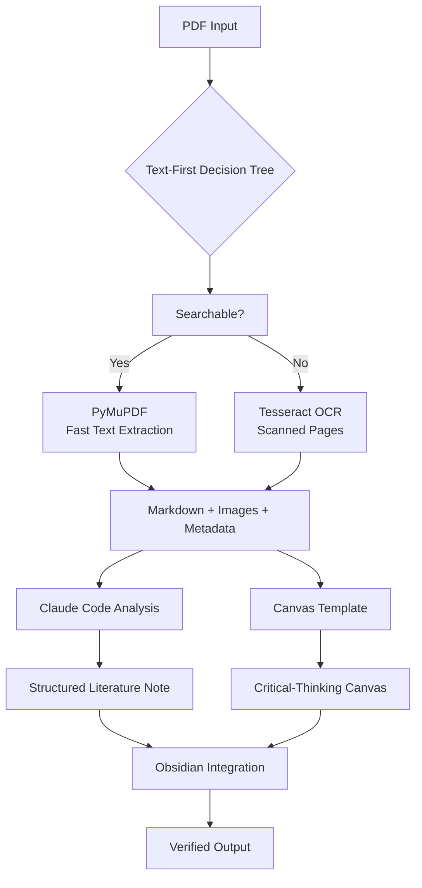

# PhD Deep Read Workflow

[](https://opensource.org/licenses/MIT)
[](https://pypi.org/project/phd-deepread-workflow/)
[](https://www.python.org/downloads/)
[](https://claude.com/claude-code)

> Transform academic PDFs into structured literature notes and critical-thinking canvases for Obsidian using AI-assisted analysis.

## 🎯 What is PhD Deep Read?

PhD Deep Read is a sophisticated workflow that helps researchers and PhD students process academic literature efficiently. It transforms raw PDFs into:

1. **Structured literature notes** following a comprehensive academic template
2. **Critical-thinking canvases** with 9 interconnected nodes for deep analysis
3. **Extracted text and images** using a smart Text-First decision tree
4. **Claude Code-assisted analysis** for high-quality note generation

Perfect for literature reviews, dissertation research, and systematic knowledge building in Obsidian.

## ✨ Key Features

### 🚀 Smart PDF Extraction
- **Text-First Decision Tree**: Pre-scans PDFs, uses fast PyMuPDF extraction for searchable text (80%+ of academic PDFs)
- **Intelligent OCR Fallback**: Only uses Tesseract OCR for scanned/complex pages
- **Image Extraction**: Preserves figures, tables, and diagrams as embedded images
- **Metadata Tracking**: Records extraction method per page for transparency

### 📝 AI-Assisted Note Generation
- **Comprehensive Template**: 175+ line `.clauderules` template with YAML frontmatter, Dataview callouts, and academic sections
- **Claude Code Integration**: Uses Claude's reasoning for critical analysis and synthesis
- **Wikilink Rich**: Extensive linking of concepts, methods, proteins, and diseases
- **Obsidian Ready**: Fully compatible with Dataview plugin and Obsidian Canvas

### 🧠 Critical-Thinking Canvases
- **9 Interconnected Nodes**: Core argument, assumptions, evidence assessment, alternative explanations, methodological critique, personal relevance, future directions, critical questions, hypothesis center
- **Visual Analysis**: Spatial arrangement facilitates deep critical thinking
- **JSON Format**: Compatible with Obsidian Canvas plugin

### ⚙️ Automated Workflow
- **Batch Processing**: Process entire directories of PDFs overnight
- **Quality Verification**: Automated checks for format consistency and quality
- **Modular Commands**: Separate commands for each workflow stage
- **Configurable**: Adjust thresholds, templates, and output formats

## 🏗️ Architecture



## 📦 Installation

### Prerequisites

- **Python 3.9+** and `pip` (Updated to support older Macs)
- **Tesseract OCR** (optional, for scanned PDFs)
- **Claude Code** (for note generation)

### Quick Install

The easiest way to install the workflow is directly from PyPI:

```bash
pip install phd-deepread-workflow
```

### As a Claude Code Skill

Note: To use this as a Claude Code skill, you should first clone the repository to access the skill files.

```bash
# Copy the skill to your Claude Code skills directory
cp -r phd-deepread-workflow ~/.claude/skills/phd-deepread

# Use the skill in Claude Code
phd-deepread setup
phd-deepread extract paper.pdf
```

### Docker Installation

For consistent environments or containerized deployment:

```bash
# Build the Docker image
docker build -t phd-deepread .

# Run a single extraction
docker run -v $(pwd)/input:/input -v $(pwd)/output:/output \
  phd-deepread extract /input/paper.pdf --output /output/

# Or use Docker Compose
docker-compose up --build
```

See [Dockerfile](Dockerfile) and [docker-compose.yml](docker-compose.yml) for advanced configurations.

## 🚀 Quick Start

### Process a Single Paper

```bash
# 1. Extract text and images
phd-deepread extract paper.pdf --output markdown_output/

# 2. Generate structured literature note (requires Claude Code)
phd-deepread generate markdown_output/paper/ --template templates/clauderules.md

# 3. Create critical-thinking canvas
phd-deepread canvas markdown_output/paper/ --output structured_notes/
```

### Full Automation (Single Command)

```bash
# Run the complete workflow with one command
phd-deepread run paper.pdf
```

### 📂 Batch Process a Directory (The "Power User" Method)
If you have a folder of PDFs and want to turn them all into Obsidian notes:

Type: phd-deepread batch  (with a space).

Input: Drag your [folder] of PDFs into the terminal.

Output: Type --output and drag your [folder in obsidian] into the terminal.

Press Enter.
Example: phd-deepread batch [folder] --output [folder in obsidian]

### Interactive Guide

```bash
# Show workflow guide with decision-tree visualization
phd-deepread guide
```

## 📖 Detailed Usage

### Stage 1: Text-First PDF Extraction

The extraction uses a smart decision tree:

```bash
phd-deepread extract paper.pdf \
  --output markdown_output/ \
  --threshold 100 \        # Min chars for "searchable"
  --percentage 0.8 \       # Use PyMuPDF if 80%+ pages searchable
  --lang eng \            # OCR language
  --disable-image-extraction  # Skip images if needed
```

**Output Structure:**
```
markdown_output/paper/
├── paper.md              # Raw markdown with embedded images
├── paper_meta.json       # Metadata, extraction methods per page
├── blocks.json          # Block-level segmentation data
└── _page_*_*.png        # Extracted images
```

### Stage 2: Structured Note Generation

Uses Claude Code with the `.clauderules` template:

```bash
phd-deepread generate markdown_output/paper/ \
  --template templates/clauderules.md \
  --output structured_notes/ \
  --skeleton              # Generate placeholder note without Claude
```

**Template Features:**
- YAML frontmatter (`category`, `tags`, `citekey`, `status`, `dateread`)
- Dataview callouts (`[!Citation]`, `[!Synthesis]`, `[!Metadata]`, `[!Abstract]`)
- 7 academic sections with critical analysis
- Wikilinks for concepts, methods, tools

### Stage 3: Critical-Thinking Canvas

Creates 9-node JSON Canvas for deep analysis:

```bash
phd-deepread canvas markdown_output/paper/ \
  --output structured_notes/ \
  --template templates/critical-thinking.canvas
```

**Canvas Nodes:**
1. **core-argument** - Primary claim and logical chain
2. **assumptions** - Explicit, implicit, questionable assumptions
3. **evidence-assessment** - Strength of evidence
4. **alternative-explanations** - Competing hypotheses
5. **methodological-critique** - Study limitations
6. **personal-relevance** - Connections to your research
7. **future-directions** - Research goals
8. **critical-questions-enhanced** - Hypothesis testing questions
9. **hypothesis-center** - Hypothesis re-evaluation

### Stage 4: Verification

Quality checks and pattern matching:

```bash
phd-deepread verify --all literature-notes/
```

## 🔧 Configuration

### Custom Templates

Modify `templates/clauderules.md` for different academic fields:

```yaml
category: literaturenote
tags:
  - #{{Field}}           # e.g., #Neuroscience, #Bioinformatics
  - #{{Topic1}}
  - #{{Topic2}}
citekey: {{camelCase: FirstAuthor+FirstWordOfTitle+Year}}
# ... rest of template
```

### Extraction Parameters

Adjust in `scripts/extract.py` or via command line:

| Parameter | Default | Description |
|-----------|---------|-------------|
| `--threshold` | 100 | Min characters to consider page searchable |
| `--percentage` | 0.8 | Use PyMuPDF if this % of pages are searchable |
| `--lang` | eng | Tesseract OCR language code |
| `--force-ocr` | false | Force OCR for all pages |
| `--force-text` | false | Force PyMuPDF for all pages |
| `--no-ocr` | false | Disable OCR entirely |

### Output Directories

Configure in `config/config.yaml`:
```yaml
# Directory paths
directories:
  markdown_output: "./markdown_output"
  structured_notes: "./structured_literature_notes"
  canvas_templates: "./canvas_templates"
  generation_prompts: "./generation_prompts"

# Extraction thresholds
extraction:
  searchable_threshold: 100
  searchable_percentage: 0.8
  ocr_language: "eng"
```

See [config/config.yaml](config/config.yaml) for all available options.

## 📊 Performance

| Scenario | Time per Paper | Accuracy | Best For |
|----------|----------------|----------|----------|
| **All searchable text** | 10-30 minutes | ~100% | Modern digital PDFs |
| **Mixed (80% text, 20% OCR)** | 30-60 minutes | ~98% | Typical academic PDFs |
| **All OCR required** | 60-120 minutes | ~95% | Scanned documents |

**Typical workflow:** 27-80 minutes per paper total (extraction + note generation + canvas creation)

## 🛠️ Troubleshooting

### Common Issues

**Tesseract OCR not installed:**
```bash
# macOS
brew install tesseract

# Ubuntu/Debian
sudo apt install tesseract-ocr

# Python wrapper
pip install pytesseract pillow
```

**PyMuPDF missing:**
```bash
pip install PyMuPDF
```

**Missing images in extraction:**
- Check PDF contains extractable images
- Ensure `--disable-image-extraction` not set
- Verify PyMuPDF version supports image extraction

**Virtual environment issues:**
```bash
# Create and activate virtual environment
python -m venv .venv
source .venv/bin/activate  # Linux/macOS
# or .venv\Scripts\activate  # Windows
pip install -r requirements.txt
```

**Claude Code integration:**
- Ensure Claude Code is installed and authenticated
- Check skill is properly installed in `~/.claude/skills/`
- Verify skill has necessary permissions

### Debug Mode

Run with verbose output:
```bash
phd-deepread extract paper.pdf --verbose --debug
```

Check logs in `logs/` directory (if configured).

## 🔄 Integration with Other Tools

### Zotero
- Use Zotero citation keys as `citekey` in frontmatter
- Export PDFs from Zotero to processing directory
- Import generated notes back into Zotero as linked files

### Obsidian
- Notes ready for Dataview queries
- Canvases work with Obsidian Canvas plugin
- Wikilinks connect to existing or future notes
- Use with Obsidian Git for version control

### Reference Managers
- BibTeX export for generated citations
- RIS format integration (planned)
- DOI lookup and metadata fetching (planned)

## 📚 Examples

See the `examples/` directory for:
- `example-output.md` - Complete structured literature note
- `example-canvas.canvas` - 9-node critical-thinking canvas
- `test_paper.pdf` - Sample PDF for testing

Example output from the batch test is in `batch_test_output/`.

## 🧪 Testing

Run the test suite:
```bash
# Run all tests
python -m pytest tests/ -v

# Test specific component
python scripts/verify.py --extract test_paper.pdf
python scripts/verify.py --note examples/example-output.md
python scripts/verify.py --canvas examples/example-canvas.canvas
```

**Note**: For the extraction test, use your own PDF file named `test_paper.pdf` in the examples directory, or replace the command with a path to your test PDF.

**Continuous Integration**: Tests run automatically on GitHub Actions for each commit and pull request. See [.github/workflows/test.yml](.github/workflows/test.yml).

## 🤝 Contributing

We welcome contributions! Please see [CONTRIBUTING.md](CONTRIBUTING.md) for details.

1. **Fork the repository**
2. **Create a feature branch** (`git checkout -b feature/amazing-feature`)
3. **Commit changes** (`git commit -m 'Add amazing feature'`)
4. **Push to branch** (`git push origin feature/amazing-feature`)
5. **Open a Pull Request**

### Development Setup

```bash
# Clone and install development dependencies
git clone https://github.com/heleninsights-dot/phd-deepread-workflow.git
cd phd-deepread-workflow
pip install -r requirements-dev.txt
pre-commit install  # Install git hooks
```

## 📄 License

This project is licensed under the MIT License - see the [LICENSE](LICENSE) file for details.

## 🙏 Acknowledgments

- **Claude Code** for AI-assisted note generation
- **PyMuPDF** for fast PDF text extraction
- **Tesseract OCR** for optical character recognition
- **Obsidian** for the excellent note-taking platform
- **All contributors** who help improve this workflow

## 📞 Support

- **Issues**: [GitHub Issues](https://github.com/heleninsights-dot/phd-deepread-workflow/issues)
- **Discussions**: [GitHub Discussions](https://github.com/heleninsights-dot/phd-deepread-workflow/discussions)
- **Email**: [heleninsights@gmail.com](mailto:heleninsights@gmail.com)

## 📈 Roadmap

- [ ] Web UI for configuration and monitoring
- [ ] Integration with more reference managers (Mendeley, EndNote)
- [ ] Advanced layout detection for complex PDFs
- [ ] Multi-language support for OCR and analysis
- [ ] Plugin system for custom templates and processors
- [ ] Cloud processing for large PDF collections
- [ ] Mobile app for on-the-go paper processing

---

<div align="center">
  <p>Made with ❤️ for the academic community</p>
  <p>If this workflow helps your research, consider giving it a ⭐ on GitHub!</p>
</div>